# 引言

本案例介绍在x86环境的昇腾硬件上，采用torch-npu直接推理方式部署MMAudio模型，并进行推理任务生成音频的迁移实践。

# 一、容器环境准备

## 1.1 创建环境

MMAudio模型部署所需环境的相关版本如下：

**使用约束**
|依赖软件|版本|
| ----------- | ----------- |
|昇腾NPU驱动|>=25.0.RC1.1商发版本|
|昇腾NPU固件|>=25.0.RC1.1商发版本|
|CANN Toolkit|>=8.2.RC1商发版本|
|CANN Kernel|>=8.2.RC1商发版本|
|CANN NNAL|>=8.2.RC1商发版本|
|Python	|>=3.10|
|PyTorch|>=2.6.0|
|torch_npu插件|>=2.6.0|


 **硬件设备**
|设备型号|NPU配置|
|---|---|
|G8600（910B2C）|	2卡|


# 二、代码和模型下载


## 2.1 下载代码和模型

MMAudio在Github上的工程地址：https://github.com/hkchengrex/MMAudio

执行命令进行下载：
```shell
git clone https://github.com/hkchengrex/MMAudio.git
```
如果Github下载不了也可以下载Gitee上的工程代码，地址：https://gitee.com/MufcLiuKai/MMAudio
```shell
git clone https://gitee.com/MufcLiuKai/MMAudio.git
```
安装Git LFS为后续模型下载做准备：
```shell
# 安装 Git LFS
apt-get update
apt-get install git-lfs

# 初始化 Git LFS
git lfs install

# 
pip install huggingface_hub==0.36.2
```
在运行demo时有些模型会自动下载，有些模型需要额外手动下载。

修改/etc/hosts，添加github的IP地址：

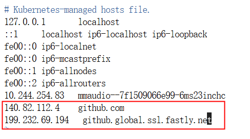

如果IP变了可以去ipaddress.com查询。后续运行Demo时有些模型会从github自动下载。

需要手动下载的模型：

apple/DFN5B-CLIP-ViT-H-14-378：

从GitCode上下载：
```shell
git clone https://gitcode.com/mirrors/apple/DFN5B-CLIP-ViT-H-14-378.git

# 或者
modelscope download --model apple/DFN5B-CLIP-ViT-H-14-378  --local_dir DFN5B-CLIP-ViT-H-14-378
```
nvidia/bigvgan_v2_44khz_128band_512x：

首先新建一个保存模型的路径：
```shell
mkdir nvidia
cd nvidia
mkdir bigvgan_v2_44khz_128band_512x
```
如果pip安装较慢或者报错，可以添加国内镜像源代理，比如阿里、清华、中科大等：
```shell
pip install modelscope -i http://mirrors.aliyun.com/pypi/simple/
pip install modelscope -i https://pypi.tuna.tsinghua.edu.cn/simple/
pip install modelscope -i http://pypi.mirrors.ustc.edu.cn/simple/
```
在nvidia目录下新建一个python脚本（如download.py）：

```shell
import os
os.environ["HF_HOME"] = "~/.cache/gitee-ai"
os.environ["HF_ENDPOINT"] = "https://hf-api.gitee.com"

from huggingface_hub import snapshot_download
snapshot_download("nvidia/bigvgan_v2_44khz_128band_512x", local_dir="./bigvgan_v2_44khz_128band_512x/")
```
执行python脚本即可下载模型：
```shell
python download.py
```

# 三、模型推理

## 3.1 依赖包安装

安装torch相关的包，比如torchaudio、torchvision等：
```shell
pip install torchvision torchaudio
```
最终效果如下：

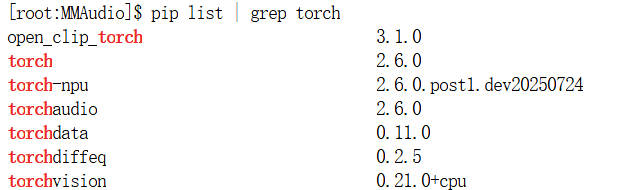

安装其他依赖包：
```shell
cd MMAudio
pip install -e .
```

## 3.2 修改代码和推理脚本

修改MMAudio/demo.py

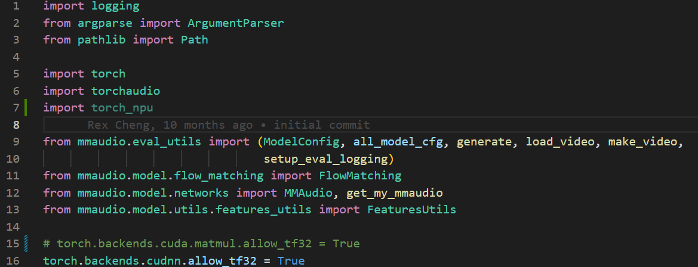

添加torch_npu，注释掉torch.backends.cuda.matmul.allow_tf32 = True。

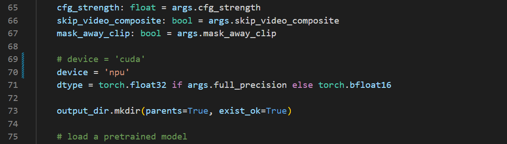

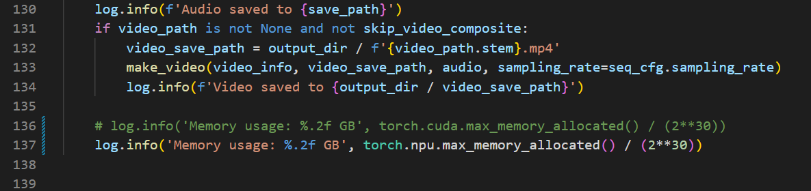

修改调用cuda为调用npu。

修改MMAudio/mmaudio/model/utils/features_utils.py：

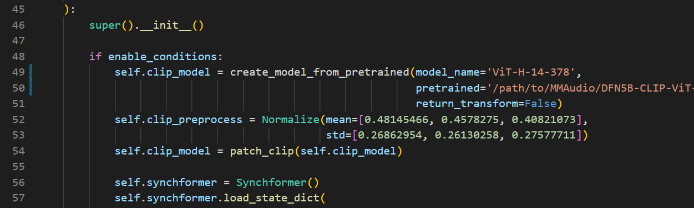

原代码
```python
self.clip_model = create_model_from_pretrained('hf-hub:apple/DFN5B-CLIP-ViT-H-14-384',
                                                           return_transform=False)
```
改为
```python
self.clip_model = create_model_from_pretrained(model_name='ViT-H-14-378',
                                                           pretrained='/path/to/DFN5B-CLIP-ViT-H-14-378/open_clip_pytorch_model.bin',
                                                           return_transform=False)
```
调用下载到本地的模型。

修改MMAudio/mmaudio/ext/autoencoder/vae.py：

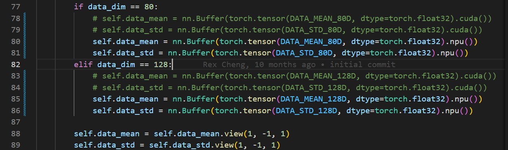


将调用cuda改为调用npu。

接下来时数据格式的修改，因为torch_npu对于BF16格式的数据的支持较少，所以要在代码中转换数据格式为Float32，不损失精度。

修改MMAudio/mmaudio/ext/bigvgan_v2/alias_free_activation/torch/filter.py：

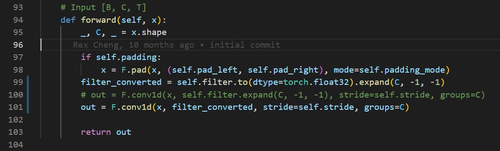

```python
        if self.padding:
            x = F.pad(x, (self.pad_left, self.pad_right), mode=self.padding_mode)
        filter_converted = self.filter.to(dtype=torch.float32).expand(C, -1, -1)
        # out = F.conv1d(x, self.filter.expand(C, -1, -1), stride=self.stride, groups=C)
        out = F.conv1d(x, filter_converted, stride=self.stride, groups=C)
```
修改MMAudio/mmaudio/ext/bigvgan_v2/alias_free_activation/torch/resample.py：

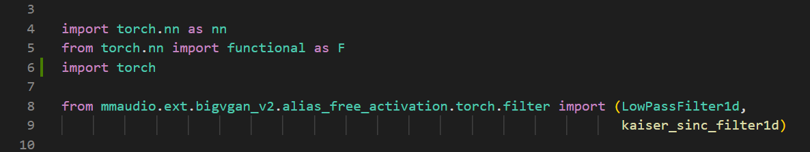

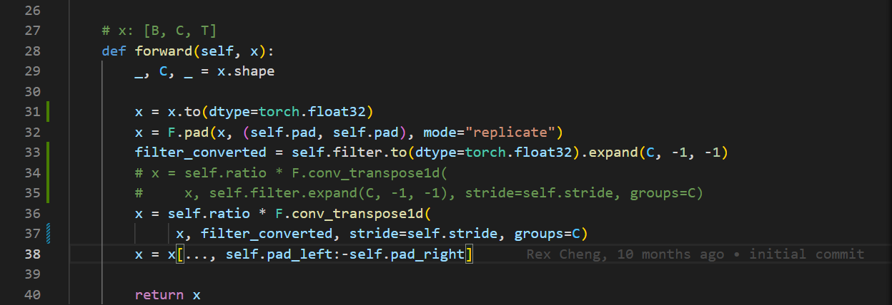

```python
def forward(self, x):
        _, C, _ = x.shape

        x = x.to(dtype=torch.float32)
        x = F.pad(x, (self.pad, self.pad), mode="replicate")
        filter_converted = self.filter.to(dtype=torch.float32).expand(C, -1, -1)
        # x = self.ratio * F.conv_transpose1d(
        #     x, self.filter.expand(C, -1, -1), stride=self.stride, groups=C)
        x = self.ratio * F.conv_transpose1d(
            x, filter_converted, stride=self.stride, groups=C)
        x = x[..., self.pad_left:-self.pad_right]

        return x
```
修改MMAudio/mmaudio/ext/bigvgan_v2/bigvgan.py：

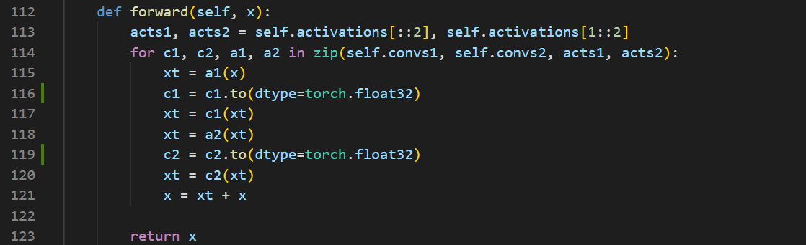

```python
 def forward(self, x):
        acts1, acts2 = self.activations[::2], self.activations[1::2]
        for c1, c2, a1, a2 in zip(self.convs1, self.convs2, acts1, acts2):
            xt = a1(x)
            c1 = c1.to(dtype=torch.float32)
            xt = c1(xt)
            xt = a2(xt)
            c2 = c2.to(dtype=torch.float32)
            xt = c2(xt)
            x = xt + x

        return x
```

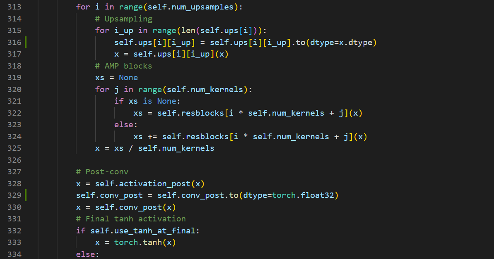

```python
 def forward(self, x):
        # Pre-conv
        x = self.conv_pre(x)

        for i in range(self.num_upsamples):
            # Upsampling
            for i_up in range(len(self.ups[i])):
                self.ups[i][i_up] = self.ups[i][i_up].to(dtype=x.dtype)
                x = self.ups[i][i_up](x)
            # AMP blocks
            xs = None
            for j in range(self.num_kernels):
                if xs is None:
                    xs = self.resblocks[i * self.num_kernels + j](x)
                else:
                    xs += self.resblocks[i * self.num_kernels + j](x)
            x = xs / self.num_kernels

        # Post-conv
        x = self.activation_post(x)
        self.conv_post = self.conv_post.to(dtype=torch.float32)
        x = self.conv_post(x)
        # Final tanh activation
        if self.use_tanh_at_final:
            x = torch.tanh(x)
        else:
            x = torch.clamp(x, min=-1.0, max=1.0)  # Bound the output to [-1, 1]

        return x
```

## 3.3 执行推理
使用以下命令执行推理脚本（文生音频模式）：
```shell
python demo.py --duration=8 --prompt "your prompt" 
```

生成的音频文件在MMAudio/demo.py设置的目录下，默认为./output。