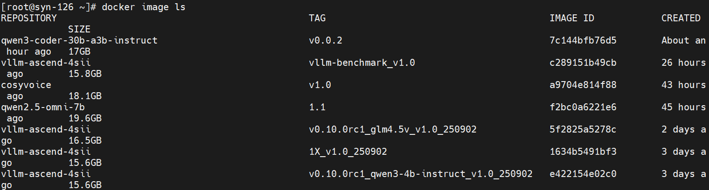
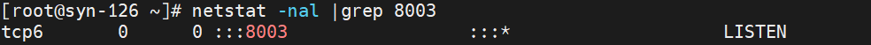
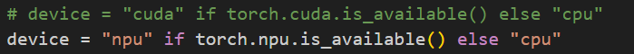
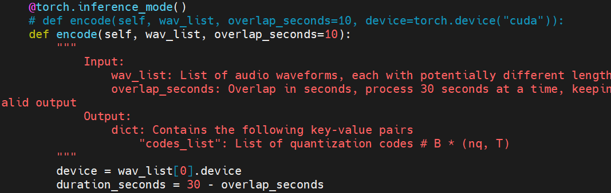
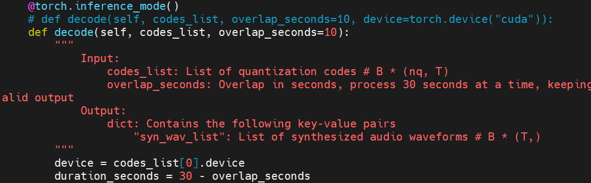
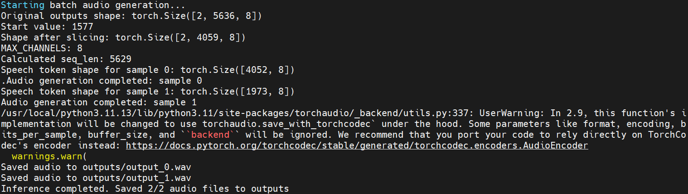
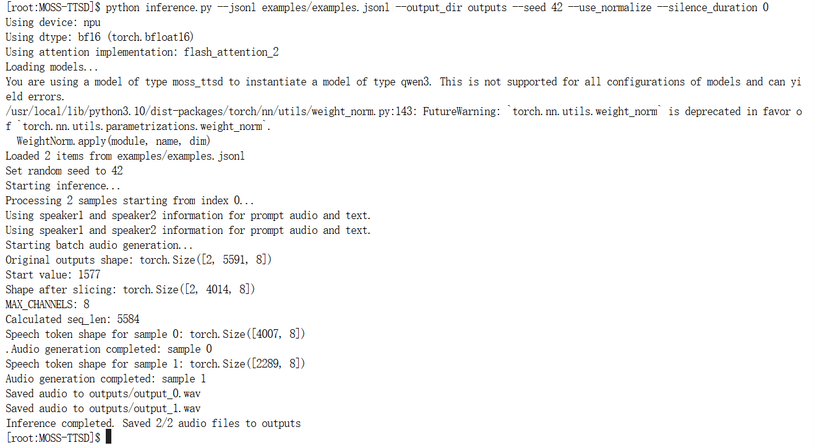
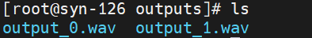

# 引言

本案例给出语音生成大模型MOSS-TTSD-v0.5在NPU环境部署，并基于torch_npu执行推理任务的迁移实践。

# 一、容器环境准备

## 1.1 拉取镜像

如果已有合适的镜像，此步可以跳过。

查看已有镜像：
```shell
docker image ls
```



 拉取镜像：
 ```shell
docker pull quay.io/ascend/vllm-ascend:v0.10.0rc1
```

MOSS-TTSD-v0.5模型部署所需环境的相关版本如下：

**使用约束**
|依赖软件|版本|
| ----------- | ----------- |
|昇腾NPU驱动|>=25.0.RC1.1商发版本|
|昇腾NPU固件|>=25.0.RC1.1商发版本|
|CANN Toolkit|>=8.2.RC1商发版本|
|CANN Kernel|>=8.2.RC1商发版本|
|CANN NNAL|>=8.2.RC1商发版本|
|Python	|>=3.11|
|PyTorch|>=2.6.0|
|torch_npu插件|>=2.6.0|


 **硬件设备**
|设备型号|NPU配置|
|---|---|
|Ascend 910B|	2卡|

## 1.2 创建容器

在蓝区服务器上使用已有的镜像quay.io/ascend/vllm-ascend:v0.10.0rc1创建docker容器，命令如下：
```shell
docker run -itd -u 0  --ipc=host --privileged \
-e VLLM_USE_MODELSCOPE=True -e PYTORCH_NPU_ALLOC_CONF=max_split_size_mb:256 \
-e  ASCEND_RT_VISIBLE_DEVICES=3 \
--name moss-ttsd \
--device=/dev/davinci3 \
--device /dev/davinci_manager \
--device /dev/devmm_svm \
--device /dev/hisi_hdc \
-v /usr/local/dcmi:/usr/local/dcmi \
-v /usr/local/bin/npu-smi:/usr/local/bin/npu-smi \
-v /usr/local/Ascend/driver/lib64/:/usr/local/Ascend/driver/lib64/ \
-v /usr/local/Ascend/driver/version.info:/usr/local/Ascend/driver/version.info \
-v /etc/ascend_install.info:/etc/ascend_install.info \
-v /home/model:/model \
-p 8003:8000 \
-it quay.io/ascend/vllm-ascend:v0.10.0rc1 bash
```
参数说明：

· name: 创建的容器名

· device=/dev/davinci3：模型使用的NPU（从0到7），示例中使用3号

· -v /home/model:/model 模型目录挂载为/model

· -p 模型端口
 
 可以使用如下命令查看端口是否有使用：
 ```shell
netstat -nal |grep 8003
```


## 1.3 进入容器

进入docker容器执行指令：

```shell
docker exec -it moss-ttsd /bin/bash
```

## 1.4 安装依赖包

在容器的MOSS-TTSD模型目录下执行如下指令安装依赖包：
```shell
pip install -r requirements.txt
```
同样可以添加国内镜像源代理：
```shell
pip install -r requirements.txt -i http://mirrors.aliyun.com/pypi/simple/
pip install -r requirements.txt -i https://pypi.tuna.tsinghua.edu.cn/simple/
pip install -r requirements.txt -i http://pypi.mirrors.ustc.edu.cn/simple/
```

# 二、下载权重

## 2.1 创建模型目录

在/home/model/目录下创建Moss模型目录并进入：
```shell
mkdir /home/model/Moss
cd /home/model/Moss
```

## 2.2 下载权重文件

Github项目：https://github.com/OpenMOSS/MOSS-TTSD

可以使用HuggingFace下载模型权重文件，不过可能连接失败，速度也可能较慢。

也可以从modelscope网站上下载一键整合包，其中已经包含了Github项目代码和MOSS-TTSD-v0.5模型权重文件，地址：https://www.modelscope.cn/models/xueshanlinghu/MOSS-TTSD-zhenghebao/summary

先安装modelscope，再用modelscope进行下载：
```shell
pip install modelscope
modelscope download --model xueshanlinghu/MOSS-TTSD-zhenghebao
```
如果pip安装较慢或者报错，可以添加国内镜像源代理，比如阿里、清华、中科大等：
```shell
pip install modelscope -i http://mirrors.aliyun.com/pypi/simple/
pip install modelscope -i https://pypi.tuna.tsinghua.edu.cn/simple/
pip install modelscope -i http://pypi.mirrors.ustc.edu.cn/simple/
```
默认下载的路径是：~/.cache/modelscope/hub/

下载完成后，使用7z或7za解压moss-ttsd开头的压缩包
```shell
7za x moss-ttsd.7z.001
```
会自动解压4卷压缩包，得到一个moss-ttsd的文件夹。

此目录下，MOSS-TTSD就是Github项目代码与资源。MOSS-TTSD-v0.5模型权重文件，在MOSS-TTSD/fnlp/MOSS-TTSD-v0.5/目录下。

# 三、运行指导

## 3.1 修改推理脚本和项目代码

修改以下代码文件并保存：

generation_utils.py

gradio_demo.py

inference.py

podcast_generate.py

streamer.py

./XY_Tokenizer/inference.py

./XY_Tokenizer/xy_tokenizer/nn/quantizer.py

将其中的所有cuda修改为npu，例如：



注意，如果是使用的modelscope的一键整合包，则还需要修改./XY_Tokenizer/xy_tokenizer/model.py的encode和decode函数，将函数的device参数去掉，从传入的list中取device。




## 3.2 执行推理

使用以下命令执行推理脚本：
```shell
python inference.py --jsonl examples/examples.jsonl --output_dir outputs --seed 42 --use_normalize --silence_duration 0
```
参数说明：

--jsonl：输入 JSONL 文件路径，包含对话脚本与参考音频

--output_dir：生成音频文件的保存目录

--seed：随机种子

--use_normalize：是否启用文本归一化（建议开启）

--dtype：模型精度（默认 bf16）

--attn_implementation：注意力实现（默认 flash_attention_2，也支持 sdpa、eager）

--silence_duration：参考音频与生成音频之间的静默时长（默认 0 秒），当生成音频开头出现杂音时（通常因为生成音频续写了prompt的尾音），请尝试将该参数设置为0.1。

 日志打印如下：
 



生成的音频文件在设置的output_dir的目录下：

